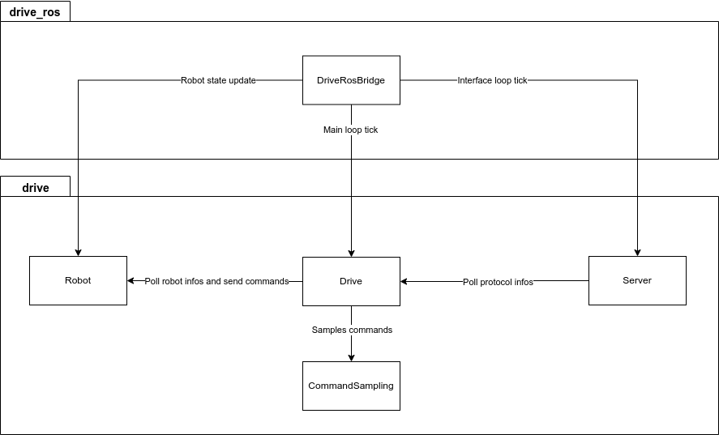
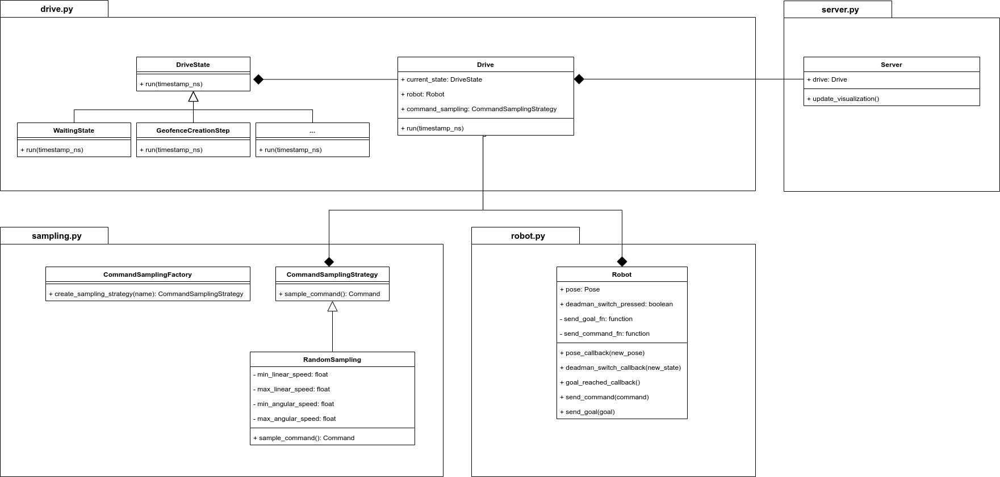

# Architecture

At a high level, all data flows from the `drive_ros` ROS2 package into the `drive` Python core. The `DriveRosBridge` class, implemented as a ROS2 node, manages both the `Drive` main loop and the `Server` interface loop at fixed intervals. It also subscribes to the robot's state topics and forwards the data to the `Robot` class. This design keeps the Python core entirely independent of ROS.

For reference, here is a more non-extensive UML diagram for the python core. It has only the important classes and interactions to better understand the flow of information:

So, the `DriveRosBridge` class need to instanciate and interact with four classes: `Robot`, `CommandSampling`, `Drive` and `Server` to be able to run the DRIVE protocol. Here is how to configure each module with your robot:

- [Robot Module](Robot.md)

- [Drive Module](Drive.md)

- [Command Sampling Module](CommandSampling.md)
