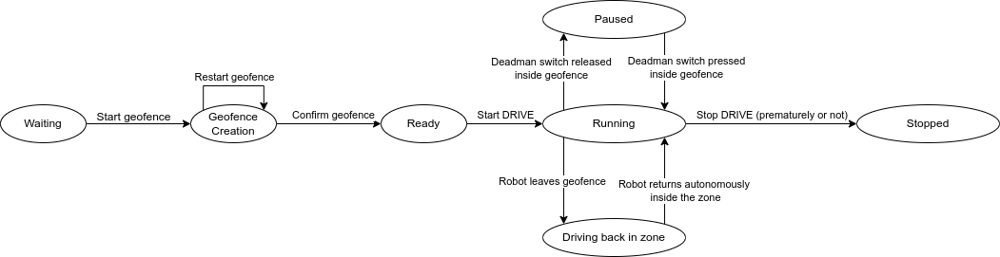

# DRIVE - Data-driven Robot Input Vector Exploration

DRIVE is an open-source uncrewed ground vehicle (UGV) training dataset gathering protocol. This protocol automates the task of driving the UGV to gather a training dataset, then used to train a motion model. The resulting model can then be used for controllers.

[](https://www.youtube.com/watch?v=tBCtC7WolL4)

👉 [See on Youtube](https://www.youtube.com/watch?v=tBCtC7WolL4)

## Prerequisites

All the code is ran on your robot inside of a Docker container so you will need:

- ROS2 (any version)
- Docker
- A network connection from your device to the robot (To access the web interface)

## Workflow

Here is the typical workflow of a DRIVE deployment:

1. Start the docker container on your robot
2. Access the web interface from your device
3. (Optional) Fill out the metadata for your experiment
4. Move the robot around to draw a geofence, an invisible barrier that the robot can't cross when collecting data
5. Confirm the geofence on the web interface
6. Place the robot inside of the geofence
7. Start the data collection on the web interface
8. Stop the protocol from the web interface once you have gathered enough drive steps

Once started, DRIVE samples a control command from a distribution of your choice (By default random). It then executes that command for six seconds on the robot and collects the information from the robot's sensors. If the robot gets out of the geofence or if the step is interrupted, it is considered a fail and will be restarted. If the step successfully completes, it then resamples another command and restart.



## Installation

The code implementation includes the following:

- The DRIVE_AGAIN python module
- A web interface to control the execution on a browser
- A ROS2 bridge to connect to your robot

To see how to install DRIVE on your robot, see [Installation](Installation.md)


## Citing

If you use DRIVE in an academic context, please cite [our preprint](https://www.researchgate.net/publication/374023495_DRIVE_Data-driven_Robot_Input_Vector_Exploration):

```bibtex
@misc{baril2023drive,
      title={DRIVE: Data-driven Robot Input Vector Exploration},
      author={Dominic Baril and Simon-Pierre Deschênes and Luc Coupal and Cyril Goffin and Julien Lépine and Philippe Giguère and François Pomerleau},
      year={2023},
      eprint={2309.10718},
      archivePrefix={arXiv},
      primaryClass={cs.RO}
}
```

## Datasets

The datasets used in our paper are publicly available.
[Follow this link to download them in Pandas Dataframe format](https://github.com/norlab-ulaval/Norlab_wiki/wiki/DRIVE-datasets).
